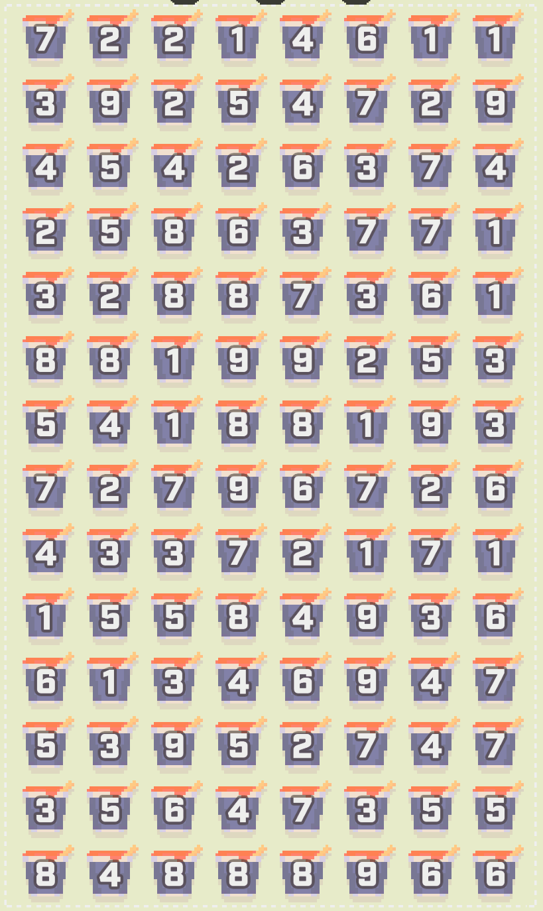
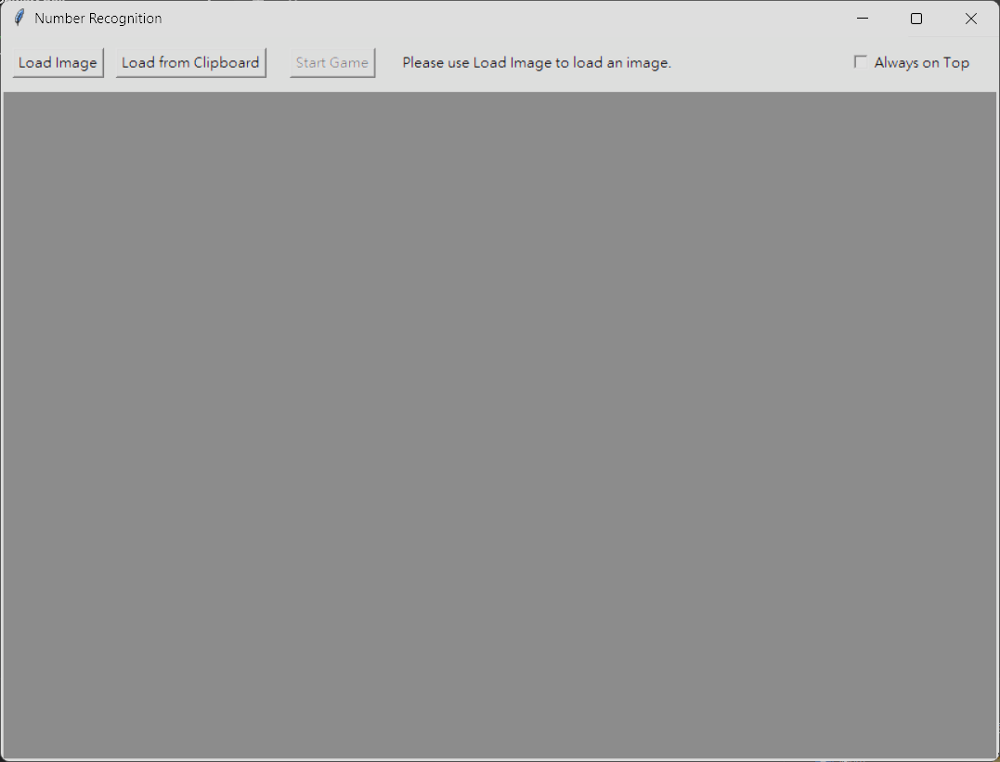
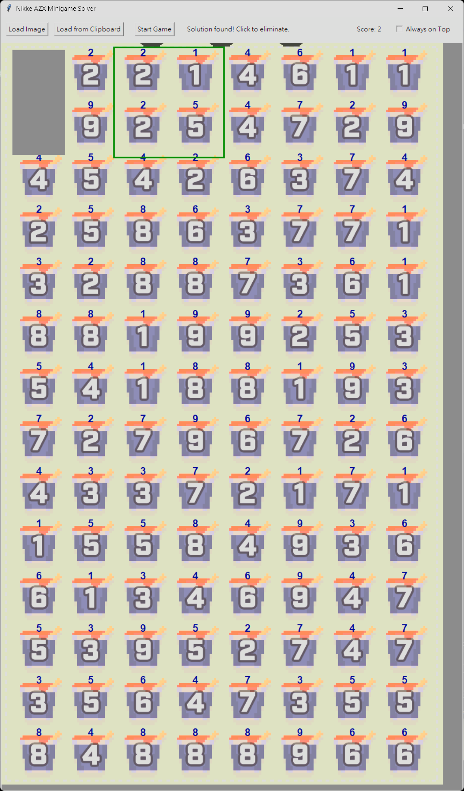

# Nikke AZX Minigame Solver

This project is a tool designed to automatically solve the number-based minigame found in the game "Goddess of Victory: Nikke". It uses computer vision to analyze a screenshot of the minigame, recognize the numbers on the grid, and present the solution.



## Features

*   **Graphical User Interface (GUI):** An easy-to-use interface to load screenshots and view the solved puzzle.
*   **Automatic Grid Detection:** Automatically finds the puzzle grid within a provided screenshot.
*   **Digit Recognition:** Employs a convolutional neural network (CNN) built with PyTorch to recognize the digits in each cell.
*   **Puzzle Solver:** Implements the logic to solve the number puzzle.

## Installation

1.  **Clone the repository:**
    ```bash
    git clone <repository-url>
    cd nikke_azx_minigame_solver
    ```

2.  **Install dependencies:**
    It is recommended to use a virtual environment.
    ```bash
    pip install -r requirements.txt
    ```

## Usage

Run the main application using the following command:

```bash
python src/gui.py
```

From the GUI, you can load a screenshot of the minigame, and the application will display the detected numbers.

- You can load an image either from a file or directly from the clipboard.
- The grid will show small blue numbers; double-check that they match the digits in the screenshot.
- If a digit is wrong, click the blue box and edit it before proceeding.
- Click `Start Game` to start computing a solution; click the game window to advance to the next solution.




## Project Structure

```
.
├── data/              # Training and custom datasets for the model
├── src/               # Source code
│   ├── gui.py         # Main GUI application
│   ├── main.py        # Core solver logic
│   ├── train.py       # Script to train the digit recognition model
│   ├── model.py       # PyTorch model definition
│   └── ...            # Other utility scripts
├── model.pth          # Pre-trained digit recognition model
├── requirements.txt   # Python dependencies
└── README.md
```

## Training the Model

The digit recognition model was trained on a custom dataset derived from game screenshots, as well as the MNIST dataset. To retrain the model, you can run the training script:

```bash
python src/train.py
```
